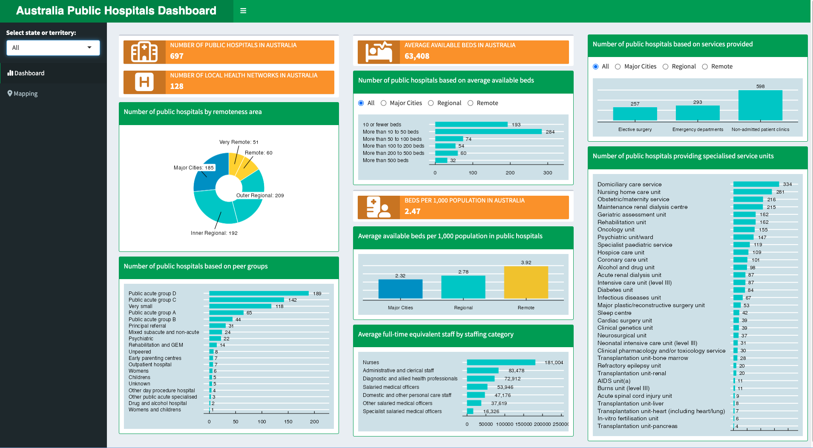
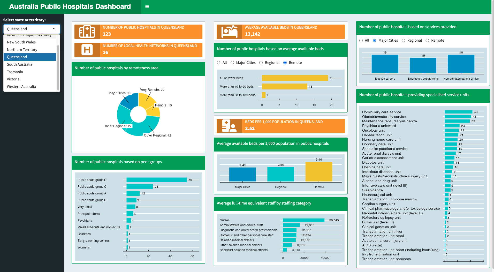
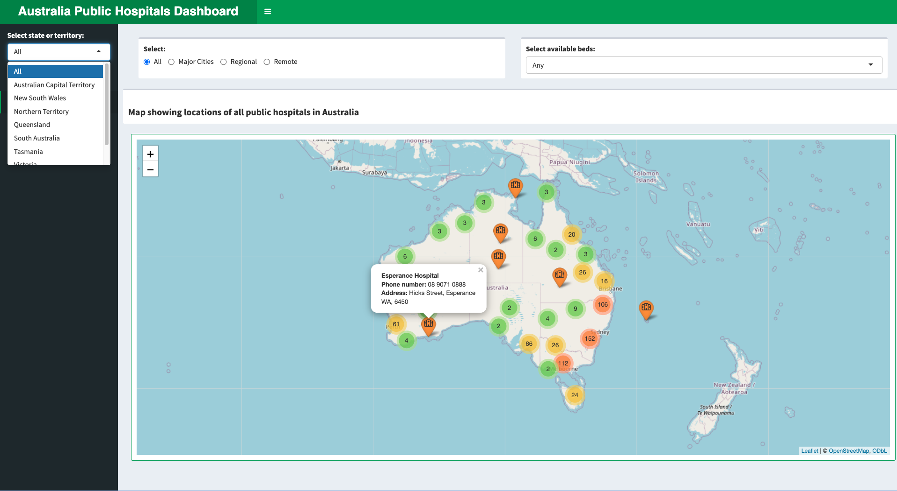
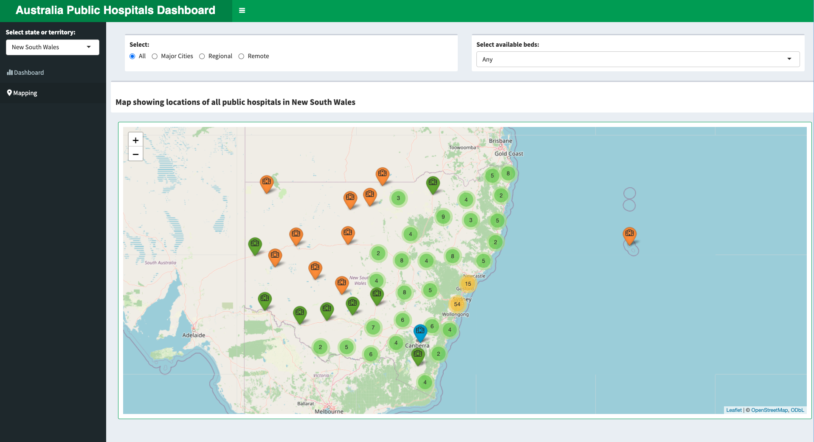
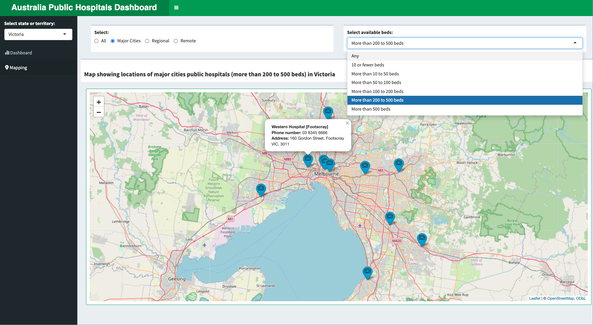

# Australia Public Hospitals Dashboard

***
 

  
  <h4> Description </h4>
  
 Hospitals are important in Australia’s health care system providing medical care to millions of Australia every year. There are private and public hospitals in Australia. 

  <ul>
  <li align= "justify"> Private hospitals - owned and managed by private organizations (some non-profit) and funded by charges to patients often subsidized by government and private health insurance </li>
  <li align= "justify"> Public hospitals - largely owned and managed by state and territory governments with funding from the Australian government. </li>
  </ul>
  
 Any person with ‘medicard’ can access public hospital services free of charge as a public patient on the basis of clinical need and within a clinically approved period.  Such services can be admitted services, non-admitted services, or emergency department (ED) services.  

  
 This dashboard shows relevant information such as the number of beds and available services on recognized and approved public hospitals in Australia. The ‘mapping’ option shows the location and details of the public hospitals with filterable options. The drop-down menu can be used to filter for state or territory.   

**Link to the Dashboard**

*Access the dashboard here:* [Australia Public Hospitals Dashboard](https://mmg1217.shinyapps.io/Aus_public_hospitals/){:target="_blank"}

***
 

#### Functionality

**A. Dashboard**

For the selected state/territory (or if Australia is selected) in the sidebar, the dashboard shows:

* the number of public hospitals, available beds and local health networks
* distribution of public hospitals based on remoteness and peer groups
* provided services and available specialized service units with the number of public hospitals providing such services
* the number of FTE staff by staffing category

**B. Mapping**

* Selecting the "Mapping" option in the sidebar lets the user view the map of the selected state/territory or of Australia showing the locations of public hospitals. Options available for selecting remoteness and available beds.
* Clicking on a public hospital shows details including name of hospital, address and contact number.

 

***Data source***

* The data was sourced from Australian Institute of Health and Welfare (AIHW) webpage, "Hospital resources 2021-2022 data tables", released December 2023 at [https://www.aihw.gov.au/reports-data/myhospitals/content/data-downloads](https://www.aihw.gov.au/reports-data/myhospitals/content/data-downloads)

 

*Image by [Freepik](https://www.freepik.com/).*

***
 

#### Preview

**Dashboard**

 

**Dashboard**

 

**Mapping**

 

**Mapping**

 

**Mapping**

 
 
 

